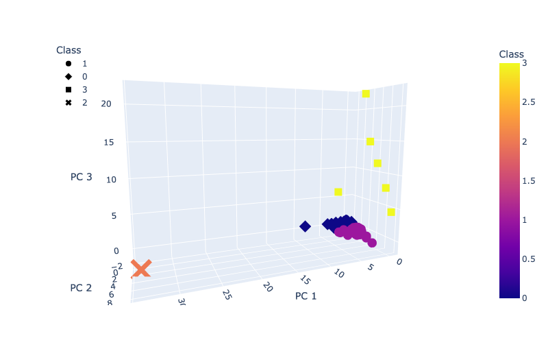

# Cryptocurrencies

## Background

Martha is a senior manager for the Advisory Services Team at Accountability Accounting, one of your most important clients. Accountability Accounting, a prominent investment bank, is interested in offering a new cryptocurrency investment portfolio for its customers. The company, however, is lost in the vast universe of cryptocurrencies. So, they’ve asked you to create a report that includes what cryptocurrencies are on the trading market and how they could be grouped to create a classification system for this new investment.

## Overview of Project

### Purpose

The data Martha will be working with is not ideal, so it will need to be processed to fit the machine learning models. Since there is no known output for what Martha is looking for, she has decided to use unsupervised learning. To group the cryptocurrencies, Martha decided on a clustering algorithm. She’ll use data visualizations to share her findings with the board.

## Analysis And Challenges

## Methodology: Analytics Paradigm

#### 1. Decomposing the Ask

* Deliverable 1: Preprocessing the Data for PCA
* Deliverable 2: Reducing Data Dimensions Using PCA
* Deliverable 3: Clustering Cryptocurrencies Using K-means
* Deliverable 4: Visualizing Cryptocurrencies Results

#### 2. Identify the Datasource
* crypto_data.csv from: https://min-api.cryptocompare.com/data/all/coinlist

### 3. Define Strategy & Metrics
**Resource:** Python, numpy, pandas, path, collechvplot.pandas, sklearn, plotly.express, StandardScaler, MinMaxScaler, PCA, KMeans

#### 4. Data Retrieval Plan
NA

#### 5. Assemble & Clean the Data
The processing is done in [Preprocessing the Data for PCA](#preprocessing-the-data-for-pca)

#### 6. Analyse for Trends

The analysis is indicated below in [Analysis](#analysis)

#### 7. Acknowledging Limitations
Need more knowledge on statistics.

#### 8. Making the Call:
The "Proper" Conclusion is indicated below in [Summary](#summary)

## Analysis

### Preprocessing the Data for PCA
The dataset is preprocessed according to requirements. The processed dataset contains 532 tradable cryptocurrencies.

### Reducing Data Dimensions Using PCA

Reduce the width of data with PCA dimension reduction to only 3 components.

### Clustering Crytocurrencies Using K-Means

Finding the best K value using elbow curve. See the above. The best K value is 4. We will run model-fit-predict on this model.

Concatenate all the features into a new dataframe.

### Visualizing Cryptocurrencies Results

We will use the new dataframe to visualise.

Using 3D scatter cluster to create cluster visualisation for grouping classification for investment.

Using hvplot.scatter cluster to create cluster visualisation for grouping classification for investment in 2D. The data needs to be scaled before we can create this visualisation. Here we have used MinMaxScaler().fit_transform to scale the data.

## Summary

Both visualisation confirms that there is 3 grouping classification for this cryptocurrencies dataset that can be used as recommendation for the investment portfolio.

## Appendix

* What knowledge do we hope to glean from running an unsupervised learning model on this dataset?
* What data is available? What type? What is missing? What can be removed?
* Is the data in a format that can be passed into an unsupervised learning model?
Can I quickly hand off this data for others to use?

### References
